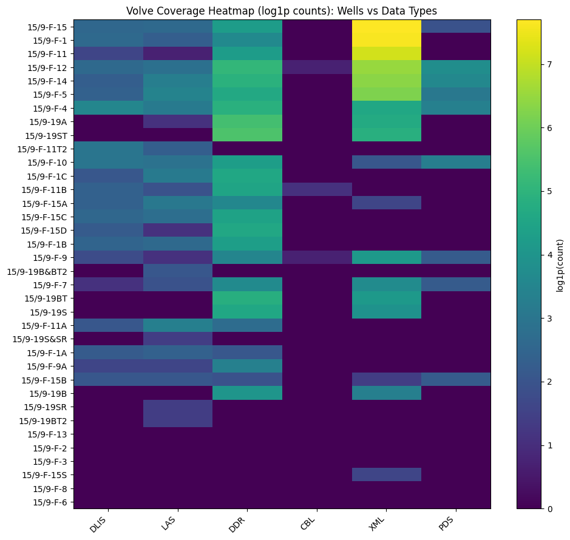

# Volve Field Dataset — Research Catalog (Metadata Index)

This repository is **NOT** a copy of the Equinor Volve dataset.

It is a searchable **metadata index** of the public Volve field dataset designed to help researchers understand **what data exists** before attempting analysis, machine learning, or engineering studies.

The real Volve dataset contains ~400,000 files across multiple inconsistent folder structures and formats. Researchers often spend days or weeks manually locating relevant logs, drilling reports, and production information. This catalog provides a discovery layer over the dataset.

---

## Dataset Coverage (Quick View)

The Volve dataset is not uniform across wells. The table below shows data availability for selected wells and allows researchers to evaluate dataset suitability before downloading files.

| Well | Total Files | DLIS Logs | LAS Logs | Daily Drilling Reports | Cement Evidence | WITSML Telemetry |
|------|-----------:|---------:|--------:|----------------------:|---------------:|----------------:|
| 15/9-F-15 | 2404 | 12 | 0 | 69 | 0 | 2209 |
| 15/9-F-1  | 2204 | 13 | 9 | 38 | 0 | 2060 |
| 15/9-F-11 | 1420 | 4  | 1 | 69 | 0 | 1294 |
| 15/9-F-12 | 965  | 13 | 0 | 165| 1 | 663  |
| 15/9-F-14 | 863  | 0  | 0 | 134| 0 | 585  |
| 15/9-F-5  | 710  | 10 | 0 | 103| 0 | 496  |
| 15/9-F-11B| 172  | 10 | 6 | 90 | 2 | 0    |
| 15/9-F-9  | 146  | 0  | 0 | 32 | 1 | 63   |

Full per-well coverage is available in: `well_registry_events.csv`

---

## What this repository provides

For every file in the public Volve dataset, the index records:

- interpreted well association
- normalized data category ("bucket")
- tags (CBL, DDR, DLIS, PLT, LWD/MWD, etc.)
- dataset path
- extension type

The repository does **NOT** host or redistribute any data. It only describes the dataset structure.

---

## Typical questions answered

- Which wells have cement evaluation evidence?
- Which wells contain daily drilling reports?
- Where are the DLIS wireline logs?
- Which wells have drilling telemetry (WITSML XML)?
- What data exists before building models?

---

## Repository structure

### Master index
- `volve_catalog_master.csv` — complete metadata index

### Per-well exports
- `/per_well/` — files grouped by well

### Per-bucket exports
- `/per_bucket/` — files grouped by data category

### Per-tag exports
- `/per_tag/` — files grouped by interpreted meaning

---

## Known sparse wells and missing categories

Some wells in the public Volve release contain very few records or lack common deliverables (e.g., no DLIS/LAS logs).  
This is not necessarily an indexing error; it reflects the public archival contents.

To avoid “ghost hunting,” use `well_registry_events.csv` to identify wells with:
- `total_files` below a small threshold (e.g., ≤ 10)
- zero counts for DLIS/LAS/DDR/XML depending on your workflow

---

## Visual coverage summary

If you add a heatmap image to `docs/coverage_heatmap.png`, embed it here:

---

## Official identifier cross-reference (not included)

This repository does not currently provide a mapping to official Norwegian Offshore Directorate (FactPages) wellbore identifiers.  
Such a crosswalk could be added in a future release if a reliable public mapping table is sourced and validated.

---

## Intended use

This repository supports dataset discovery and reproducible Volve field studies. It is a navigation system for the dataset, not a replacement for it.

---

## Dataset source

Equinor public data release: https://www.equinor.com/energy/volve-data-sharing
